# 🚑 Linhagem Consolidada: Pronto-Socorro (PS)

Este documento demonstra como múltiplas fontes do **Oracle Tasy** são unificadas em uma única estrutura de destino para auditoria.

---

## 🔄 Fluxo de Consolidação (ETL)

```mermaid
graph LR
    subgraph "SISTEMA ORIGEM (ORACLE TASY)"
        T1[tasy.atendimento_paciente]
        T2[tasy.prescr_procedimento]
        T3[tasy.proc_interno]
        T4[tasy.atend_paciente_unid]
        T5[tasy.pessoa_fisica]
    end

    subgraph "STAGING (POSTGRESQL)"
        ST[tbl_tempos_entrada_consulta_saida]
        STX[tbl_tempos_rx_e_ecg]
        STM[tbl_tempos_medicacao]
    end

    subgraph "MODELO SEMÂNTICO (DAX)"
        DAX['fluxo']
    end

    T1 & T4 & T5 -->|Consolidação| ST
    T2 & T3 -->|Filtragem Imagem| STX
    T2 & T3 -->|Filtragem Farmácia| STM
    ST & STX & STM -->|Relacionamento 1:1| DAX
```

---

## 🔗 Matriz de Linhagem de Dados (Tabela Única)

**Tabela de Destino (Consolidada):** `tbl_tempos_entrada_consulta_saida` (Postgres) / `'fluxo'` (DAX)

| # | Medida DAX | Fonte Original (Oracle Tasy) | Staging (PostgreSQL) | Regra de Negócio / Lógica |
|---|------------|----------------------------|----------------------|---------------------------|
| 1 | Atend > Triagem | `tasy.atendimento_paciente`| `tbl_tempos_entrada_consulta_saida` | Verifica se o tempo entre a entrada e a triagem ultrapassou a meta de 12 minutos. |
| 2 | % Atend > Triagem | `tasy.atendimento_paciente`| `tbl_tempos_entrada_consulta_saida` | Percentual de atendimentos com tempo de triagem acima da meta de 12 minutos. |
| 3 | Atend > Consulta | `tasy.atendimento_paciente`| `tbl_tempos_entrada_consulta_saida` | Verifica se o tempo entre a entrada e a consulta médica ultrapassou a meta de 90 minutos. |
| 4 | % Atend > Consulta | `tasy.atendimento_paciente`| `tbl_tempos_entrada_consulta_saida` | Percentual de atendimentos com espera para consulta acima da meta de 90 minutos. |
| 5 | Atend > Medicacao | `tasy.prescr_procedimento` | `tbl_tempos_medicacao` | Verifica se o tempo entre a prescrição e a checagem da medicação ultrapassou 30 minutos. |
| 6 | % Atend > Medicacao| `tasy.prescr_procedimento` | `tbl_tempos_medicacao` | Percentual de medicações administradas com atraso superior a 30 minutos. |
| 7 | Atend > Tempo RX | `tasy.prescr_procedimento` | `tbl_tempos_rx_e_ecg` | Verifica se o tempo entre a solicitação e a execução do RX/ECG ultrapassou 60 minutos. |
| 8 | % Atend > Tempo RX| `tasy.prescr_procedimento` | `tbl_tempos_rx_e_ecg` | Percentual de exames de RX/ECG realizados fora do tempo alvo de 60 minutos. |
| 9 | Atend > Tempo TC | `tasy.prescr_procedimento` | `tbl_tempos_tc_e_us` | Verifica se o tempo entre a solicitação e a execução da Tomografia ultrapassou 120 minutos. |
| 10| % Atend > Tempo TC | `tasy.prescr_procedimento` | `tbl_tempos_tc_e_us` | Percentual de tomografias realizadas fora do tempo alvo de 120 minutos. |
| 11| Atend > Reaval | `tasy.atend_paciente_unid` | `tbl_tempos_reavaliacao`| Verifica se o tempo entre a solicitação de reavaliação e o desfecho clínico excedeu a meta. |
| 12| % Atend > Reaval | `tasy.atend_paciente_unid` | `tbl_tempos_reavaliacao`| Percentual de pacientes que aguardaram reavaliação além do tempo institucional. |
| 13| Atend > Tempo Alta | `tasy.atendimento_paciente`| `tbl_tempos_entrada_consulta_saida` | Verifica se a permanência total do paciente no PS excedeu a meta de 4 horas (240 min). |
| 14| % Atend > Tempo Alta| `tasy.atendimento_paciente`| `tbl_tempos_entrada_consulta_saida` | Percentual de atendimentos com permanência total acima da meta de 4 horas. |
| 15| Qtd Atend | `tasy.atendimento_paciente`| `tbl_tempos_entrada_consulta_saida` | Contagem total de fichas de atendimento únicas geradas no período selecionado. |
| 16| Percentual Dinâmico | `Múltiplas Tabelas` | — | Seleção dinâmica de indicadores de performance via parâmetro de campo no Power BI. |
| 17| media_min_triagem | `tasy.atendimento_paciente`| `tbl_tempos_entrada_consulta_saida` | Tempo médio real, em minutos, decorrido entre a recepção e o início da triagem. |
| 18| media_min_consulta| `tasy.atendimento_paciente`| `tbl_tempos_entrada_consulta_saida` | Tempo médio real, em minutos, decorrido entre a recepção e o início do atendimento médico. |
| 19| % evasao | `tasy.motivo_alta` | `tbl_tempos_entrada_consulta_saida` | Percentual de pacientes que abandonaram o pronto-socorro antes do desfecho clínico. |
| 20| Qtd Evasao | `tasy.motivo_alta` | `tbl_tempos_entrada_consulta_saida` | Número total de pacientes registrados com desfecho de evasão. |
| 21| **Média Permanência PS** | `tasy.atendimento_paciente`| `tbl_tempos_entrada_consulta_saida` | Cálculo do tempo médio de estadia na urgência (SQL: `AVG(dt_alta - dt_entrada)`). |

---

## 🛠️ Notas de Auditoria
As metas de tempo do Pronto-Socorro (12min Triagem, 90min Consulta, 60min RX, 240min Permanência Total) são parâmetros institucionais para o nível de serviço.

